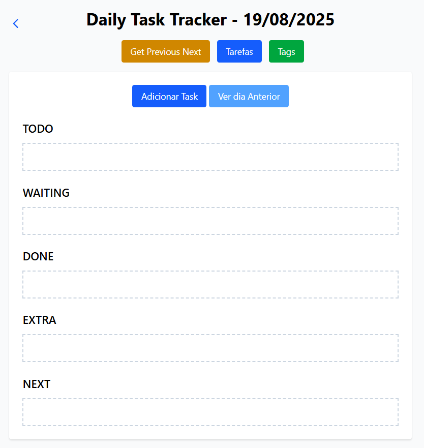

# Daily Task Tracker



**Objetivo:**
Aplicação para anotar tarefas diárias, registrá-las em banco de dados para análises futuras, reaproveitar tasks antigas e contar com uma interface prática e organizada.

## Stack

+ PHP/Laravel/Jquery/SQLite

## 💻 Uso

* Adicione tarefas no dia atual.
* Durante o dia, mude o status das tarefas conforme avança.
* No dia seguinte, você pode **reaproveitar** as tarefas marcadas como `"Next"` do dia anterior, movendo-as para `"Todo"` no dia atual.
* É possível navegar entre diferentes dias para revisar ou consultar histórico.

## 📦 Instalação

1. **Instalar dependências do PHP e Node**

   ```bash
   composer install
   npm install
   ```

2. **Gerar arquivos front-end (Tailwind + JS)**

   * Para gerar a versão final:

     ```bash
     npm run build
     ```

   * **Observação:**

     * Não é necessário deixar `npm run dev` rodando se fizer o build final.
     * Caso adicione uma nova classe do Tailwind, será necessário rodar novamente:

       ```bash
       npm run build
       ```

3. **Rodar servidor Laravel**

   * Em um terminal:

     ```bash
     php artisan serve
     ```

   * Em outro terminal (para Tailwind no modo otimizado):

     ```bash
     npm run dev
     ```

4. **Configurar banco de dados SQLite**

   * Criar o arquivo vazio:

     ```bash
     touch database/database.sqlite
     ```

   * Habilitar no `php.ini` as extensões:

     ```ini
     extension=pdo_sqlite
     extension=sqlite3
     ```

5. **Gerar as tabelas**

   ```bash
   php artisan migrate
   ```

6. **Para limpar e recriar todo o banco**

   ```bash
   php artisan migrate:fresh
   ```

7. **Gerar chave de aplicação (primeira instalação)**

   ```bash
   php artisan key:generate
   ```

---


