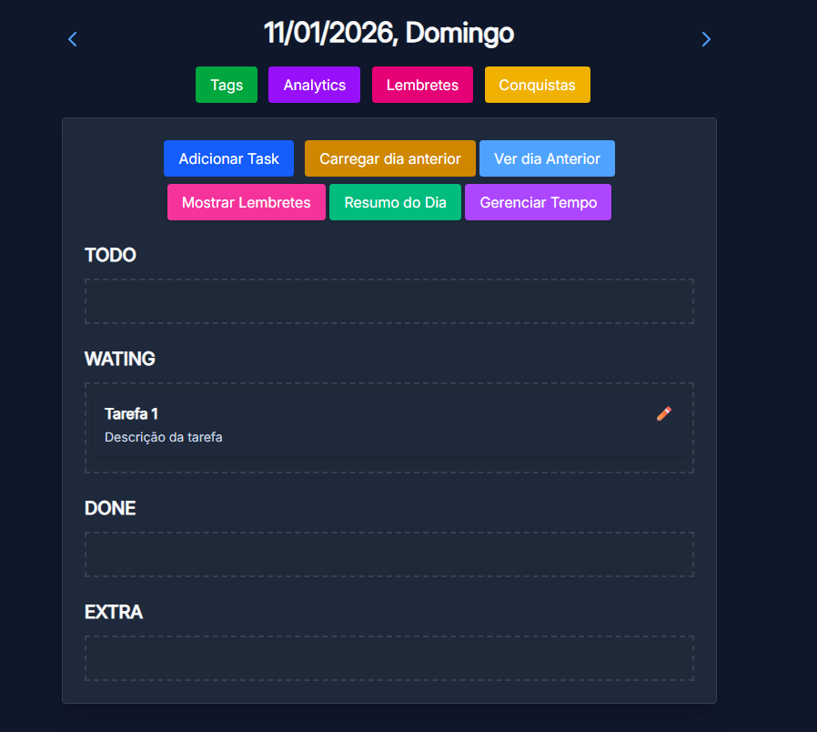

# Daily Task Tracker



Aplicação pessoal para planejar tarefas diárias, acompanhar pendências entre dias e registrar informações de produtividade. O projeto combina um Kanban diário com tags, lembretes, resumo do dia, controle de tempo, analytics, conquistas e anotações globais.

## Funcionalidades

- **Kanban diário:** tarefas organizadas nas raias `TODO`, `WAITING`, `DONE` e `EXTRA`, com movimentação por drag and drop.
- **Navegação por data:** acesso ao dia anterior ou seguinte que possua tarefas.
- **Continuidade de tarefas:** cópia de tarefas pendentes (`todo` e `waiting`) de uma data anterior para o dia atual.
- **Histórico de tarefas:** tarefas copiadas preservam `id_original`, permitindo consultar sua linhagem, data inicial e duração.
- **Tempo em aberto:** tarefas copiadas exibem no Kanban há quantos dias estão abertas desde a criação original.
- **Tags de tarefas:** múltiplas tags coloridas por tarefa, com tela própria de gerenciamento.
- **Lembretes:** lembretes recorrentes e esporádicos, incluindo histórico dos esporádicos finalizados.
- **Resumo diário:** texto livre associado de forma única a cada data.
- **Revisão diária:** fechamento do dia com tarefas, lembretes, humor, energia e relatório Markdown; reutiliza o texto do resumo diário.
- **Gestão de tempo:** registros de atividade com início, fim, duração calculada e categorias próprias.
- **Analytics mensal:** relatório de tarefas originais e o estado mais recente de cada linhagem.
- **Conquistas:** registros agrupados por período no formato `MM/AAAA`.
- **Anotações:** CRUD de textos globais com título, descrição e conteúdo renderizado como Markdown seguro.
- **Dark mode:** alternância manual com preferência armazenada no navegador.

Os endpoints AJAX usam o contrato `{ success, message, data, errors }`. Falhas de validação, sessão expirada e registros não encontrados também retornam esse formato para que a interface apresente uma ação clara ao usuário.

> **Compatibilidade de dados:** a migration `2026_08_13_010000_rename_wating_lane_to_waiting` converte o valor legado `wating` para `waiting`, normaliza o antigo `next` como `todo` e atualiza a restrição da coluna no SQLite. Aplique as migrations antes de usar esta versão.

## Tecnologias

- PHP 8.2 ou superior
- Laravel 12
- SQLite
- Blade
- Tailwind CSS 4
- JavaScript, jQuery 3 e jQuery UI
- Vite 6
- Docker Compose com Nginx e PHP-FPM (opcional)

## Requisitos para instalação local

- PHP 8.2+ com `pdo_sqlite` e `sqlite3`
- Composer 2
- Node.js 20+ e npm

## Instalação local

Clone o projeto e instale as dependências:

```bash
composer install
npm install
```

Crie o arquivo de ambiente:

```bash
cp .env.example .env
```

No PowerShell, use:

```powershell
Copy-Item .env.example .env
```

Prepare a aplicação e o banco:

```bash
php artisan key:generate
php -r "file_exists('database/database.sqlite') || touch('database/database.sqlite');"
php artisan migrate
```

Compile os assets e inicie o Laravel:

```bash
npm run build
php artisan serve
```

A aplicação ficará disponível, por padrão, em [http://localhost:8000](http://localhost:8000).

### Desenvolvimento do frontend

Para recompilar Tailwind e JavaScript automaticamente durante alterações:

```bash
npm run dev
```

Em outro terminal, mantenha o Laravel em execução:

```bash
php artisan serve
```

## Execução com Docker Compose

O ambiente Docker utiliza dois serviços:

- `nginx`: servidor HTTP e arquivos estáticos;
- `app`: Laravel executado com PHP 8.3 FPM.

Antes da primeira execução, crie o `.env` caso ele ainda não exista:

```bash
cp .env.example .env
```

Depois construa e inicie os serviços:

```bash
docker compose up --build
```

Acesse [http://localhost:8000](http://localhost:8000). Para executar em segundo plano:

```bash
docker compose up --build -d
```

Para encerrar:

```bash
docker compose down
```

O diretório local `database/` é montado no container, portanto o arquivo `database.sqlite` é preservado. O diretório `storage/` utiliza um volume Docker. Na inicialização, o entrypoint cria os diretórios necessários, ajusta permissões e executa `php artisan migrate --force`.

Para usar outra porta:

```bash
APP_PORT=8080 docker compose up --build
```

No PowerShell:

```powershell
$env:APP_PORT=8080
docker compose up --build
```

## Estrutura do projeto

| Caminho | Responsabilidade |
|---|---|
| `app/Constants/Lanes.php` | Valores válidos das raias do Kanban |
| `app/Http/Controllers/` | Regras HTTP e casos de uso da aplicação |
| `app/Models/` | Modelos Eloquent e relacionamentos |
| `database/migrations/` | Estrutura do SQLite |
| `resources/views/` | Layout e páginas Blade |
| `resources/css/app.css` | Entrada do Tailwind e variante do dark mode |
| `resources/js/app.js` | Entrada JavaScript compilada pelo Vite |
| `public/js/script.js` | Interações jQuery da tela principal |
| `public/js/analytics.js` | Carregamento e renderização dos analytics |
| `routes/web.php` | Rotas web e endpoints AJAX |
| `docker/` | Imagens PHP-FPM/Nginx, configuração web e entrypoint |
| `docker-compose.yml` | Orquestração local dos containers |

## Modelo de dados resumido

- `tasks`: tarefa de uma data, raia, ordenação e referência opcional à tarefa original.
- `tags` e `tag_task`: tags de tarefas e relacionamento muitos-para-muitos.
- `reminders`: lembretes `recurring` ou `sporadic`.
- `day_summaries`: um resumo por data.
- `daily_reviews`: uma revisão por data, com check-in opcional e snapshot do relatório Markdown.
- `time_management_entries`: registros de tempo de uma data.
- `time_management_tags`: categorias exclusivas da gestão de tempo.
- `achievements`: conquistas agrupadas por período.
- `notes`: anotações globais com título, descrição e conteúdo Markdown.
- `sessions`, `cache` e tabelas de fila: infraestrutura padrão do Laravel configurada no SQLite.

## Rotas e telas principais

| Caminho | Finalidade |
|---|---|
| `/` | Kanban do dia atual |
| `/day/{date}` | Kanban de uma data específica |
| `/day/{date}/review` | Revisão e fechamento da data |
| `/tags` | Gerenciamento de tags de tarefas |
| `/analytics` | Relatório mensal |
| `/reminders` | Central de lembretes |
| `/time-management/tags` | Categorias da gestão de tempo |
| `/achievements` | Registro de conquistas |
| `/notes` | Listagem e gerenciamento de anotações em Markdown |

Para visualizar todas as rotas:

```bash
php artisan route:list --except-vendor
```

## Comandos úteis

```bash
# Limpar caches do Laravel
php artisan optimize:clear

# Aplicar migrations pendentes
php artisan migrate

# Recompilar assets para produção
npm run build

# Validar a sintaxe do JavaScript principal
node --check public/js/script.js
```
